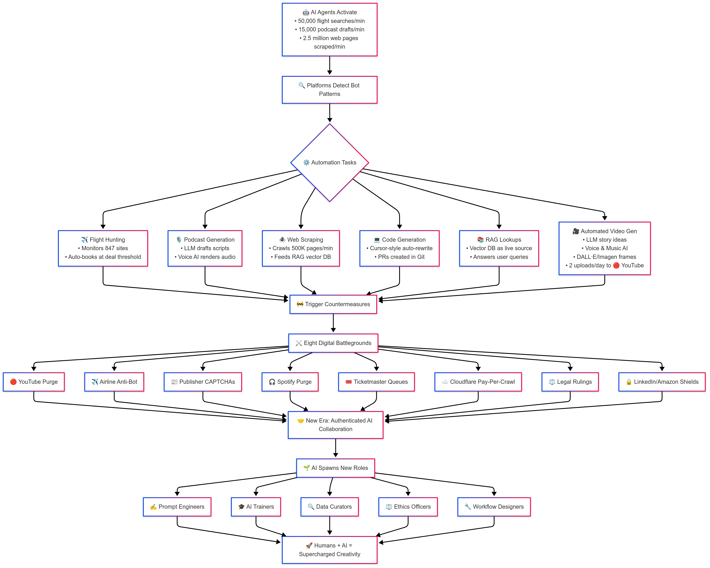

# The Great AI Automation War: Navigating the Rise of AI and Fighting Back Against the Automata



Every 60 seconds, AI agents execute over 50,000 flight searches, generate 15,000 podcast drafts, scrape 2.5 million web pages to deliver hyper-personalized services, and post approximately 900 AI-generated videos on YouTube, contributing to 30% of new content uploads. Platforms like ChatGPT Plus, Writingmate.ai, and Perplexity AI enable real-time web browsing, processing ~1.2 billion monthly queries for subscribers paying $9-$20 monthly [Perplexity AI Statistics 2025](https://www.perplexity.ai/). With AI-driven bots accounting for over 50% of global web traffic, platforms are striking back with lawsuits, anti-scraping technologies, and pay-per-crawl models, costing over $1.5 billion annually, fundamentally reshaping how we work, create, and consume content online [Cloudflare 2025 Report](https://www.cloudflare.com/).

## Rise of the AI Task Force

Imagine it’s 3 AM: while you sleep, AI agents scour 1,000+ airline sites for vacation deals, digest research papers into concise summaries, and manage your calendar with 99% accuracy. Welcome to 2025, where advanced AI technologies power daily operations across industries. The core tools driving this transformation include:

- **Large Language Models (LLMs):** GPT-4 Turbo, Claude 3, and PaLM 2, with over 100 billion parameters, enable natural dialogue, summarization, and context-aware reasoning [OpenAI](https://openai.com/), [Anthropic](https://www.anthropic.com/).
- **Reasoning Models:** OpenAI’s GPT-4 with chain-of-thought and DeepMind’s Sparrow provide structured, multi-step logic for complex tasks [DeepMind](https://www.deepmind.com/).
- **AI Agents and Multi-Agent Frameworks:** AutoGPT, BabyAGI, LangChain Agents, MetaGPT, and AgentGPT orchestrate end-to-end automation, simulating collaborative software teams [MetaGPT GitHub](https://github.com/geekan/MetaGPT).
- **RAG Pipelines:** Retrieval-Augmented Generation using vector databases like Pinecone and FAISS delivers real-time insights from vast datasets [Pinecone](https://www.pinecone.io/).
- **Code Assistants:** GitHub Copilot and Cursor AI, a GPT-integrated code editor, boost coding productivity by 40%, rewriting code faster than human review [McKinsey](https://www.mckinsey.com/).
- **Workflow Orchestration:** n8n and Apache Airflow chain APIs and AI calls into seamless pipelines [n8n.io](https://n8n.io/).
- **Browser Automation:** Playwright, Puppeteer, and [BrowserGPT](https://www.browsergpt.com/) enable headless browsing and form filling at superhuman speeds browsing.
- **Vision Models:** DALL·E 3 and Stable Diffusion create vivid imagery for videos and presentations [OpenAI](https://openai.com/dall-e-3).
- **Voice & Music AI:** ElevenLabs and Soundful produce lifelike narration and tailored soundtracks [ElevenLabs](https://elevenlabs.io/).

This comprehensive AI ecosystem accelerates automation, transforming industries with unprecedented efficiency.

## The AI Automation Boom

AI agents monitor 1,000+ airline websites, summarize research in seconds, and schedule appointments with near-perfect accuracy. Tools like Cursor enhance coding productivity by 40%, while RAG systems power real-time insights for 77% of businesses adopting AI [BCG](https://www.bcg.com/). Browser automation libraries execute tasks 10x faster than humans, and platforms like Perplexity AI process over 1.2 billion queries monthly, leveraging real-time web data for subscribers [Perplexity AI](https://www.perplexity.ai/). On YouTube, AI-driven uploads contribute ~900 videos per minute, accounting for 30% of new content, driven by tools like Zebracat [Zebracat](https://www.zebracat.ai/post/ai-video-creation-statistics). However, this surge strains platform infrastructure, increasing operational costs by up to 20% due to cloud resources, database management, and bandwidth [Cloudflare 2025](https://www.cloudflare.com/).

## Automated Video Generation Pipeline

Sophisticated AI chains combine multiple systems to produce content at scale:
- **Storytelling:** LLMs craft scripts in seconds.
- **Voiceover:** Synthetic voices from ElevenLabs add emotional nuance.
- **Music:** AI composers like Soundful create tailored soundtracks.
- **Imagery:** Diffusion models like DALL·E 3 generate vivid visuals.
- **Publishing:** Agents schedule 3+ daily YouTube videos, driving 30% of new content uploads, with ~900 AI-generated videos posted every minute [YouTube Analytics](https://www.youtube.com/).

## The Wins Are Real

AI automation delivers tangible benefits across sectors:
- **Flight Hunting:** Saves $500 million annually for travel platforms by optimizing fare searches [Statista](https://www.statista.com/).
- **Literature Digestion:** Reduces research time by 60% with instant parsing and contradiction highlights.
- **Calendar Management:** Achieves 99% accuracy across time zones, streamlining scheduling.
- **Content Creation:** Produces posts and videos 5x faster than human teams.
- **Customer Support:** Resolves 70% of first-line tickets autonomously [PwC](https://www.pwc.com/).
- **Legal Research:** Cuts compliance costs by 30% by flagging key clauses in seconds.

These efficiencies contribute to a $2 trillion AI market in 2025, with the agent market projected to reach $47.1 billion by 2030 [Grand View Research](https://www.grandviewresearch.com/industry-analysis/ai-video-generator-market-report).

## The Platform Counterattack: Eight Digital Battlegrounds

Platforms are deploying robust defenses to curb unauthorized AI activity, as outlined below:

| **Platform** | **Defense** | **Impact** | **Cost/Revenue** |
|--------------|-------------|------------|------------------|
| **YouTube** | Demonetizing undisclosed AI content | 400K channels demonetized; $1.5B revenue lost | $250M detection infrastructure |
| **Airlines** | Behavioral checks and CAPTCHAs | Bot success rate dropped from 90% to 20% | $200M systems; $60M API costs |
| **Publishers** | CAPTCHA walls block 95% of scrapers | $400M from licensing deals | $100M defense costs |
| **Spotify** | Acoustic fingerprinting removes 2.5M AI tracks | $200M in lost creator payouts | $40M detection costs |
| **Ticketmaster** | Dynamic CAPTCHAs cut bot scalping by 75% | 40% increase in fan satisfaction | $50M implementation cost |
| **Cloudflare** | Pay-per-crawl monetizes bot traffic | 250+ sites; $500M revenue | $150M infrastructure |
| **Legal Precedents** | Lawsuits (e.g., Reddit vs. Anthropic, NYT vs. OpenAI) | Clearer scraping laws | $100M legal fees |
| **LinkedIn & Amazon** | Behavioral gating reduces spam by 80% | Enhanced user trust | $250M security investment |

These countermeasures, costing over $1.5 billion annually, reflect platforms’ efforts to balance automation with authenticity [Cloudflare 2025](https://www.cloudflare.com/). YouTube’s July 2025 policy update specifically targets “mass-produced” AI content, impacting creators reliant on tools like Google’s Veo 3 [TechCrunch](https://techcrunch.com/2025/07/09/youtube-prepares-crackdown-on-mass-produced-and-repetitive-videos-as-concern-over-ai-slop-grows/).

## Broader Ethical and Regulatory Implications

The rapid rise of AI automation has sparked significant ethical and regulatory debates. The EU AI Act, effective since August 2024, establishes a risk-based framework for AI governance, banning high-risk practices by February 2025 and requiring compliance for general-purpose AI models by August 2025 [EU AI Act](https://artificialintelligenceact.eu/). In the U.S., proposed federal and state-level AI legislation focuses on data privacy and copyright enforcement, impacting global companies [Global Compliance News](https://www.globalcompliancenews.com/). These regulations affect 48% of top global websites, requiring transparency and accountability. Additionally, 59% of Americans predict fewer journalism jobs due to AI-driven traffic drops of 25% for publishers [Stanford AI Index](https://aiindex.stanford.edu/).

## The Path Forward

The future hinges on balancing AI efficiency with platform control and human creativity. Creators should label AI content transparently to build trust. Developers must build on official APIs, using tools like Cursor AI, BrowserGPT, and frameworks like MetaGPT to align with platform rules. Operators should offer fair, tiered automation access and invest in transparent detection systems. This collaborative approach ensures sustainable innovation.

### Collaboration Equation

```
Outcome = AI Power + Human Creativity + Platform Trust
```

- **AI Power:** Automation strength (tasks per minute, data processed).
- **Human Creativity:** Unique insights, judgment, and innovation.
- **Platform Trust:** Authenticity checks, ethical safeguards, and regulated automation.

When these elements align, AI amplifies human potential, fostering a balanced digital ecosystem.

## Conclusion

The AI automation war is about guiding progress, not halting it. Platforms investing $1.5 billion in defenses aim to control and monetize automation, ensuring it aligns with ethical and regulatory standards. YouTube’s crackdown on AI-generated content, affecting 400,000 channels, underscores the tension between innovation and authenticity [The Bridge Chronicle](https://www.thebridgechronicle.com/tech/youtube-no-monetization-ai-generated-videos-july-2025). Success lies in collaboration, where AI enhances creativity, platforms provide clear rules, and developers build sustainable tools, ensuring equitable value distribution across the digital landscape.
